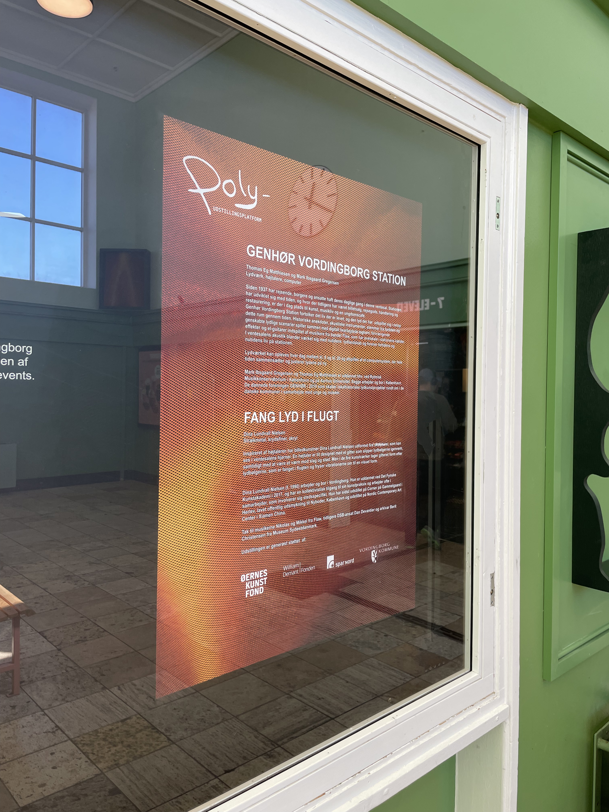
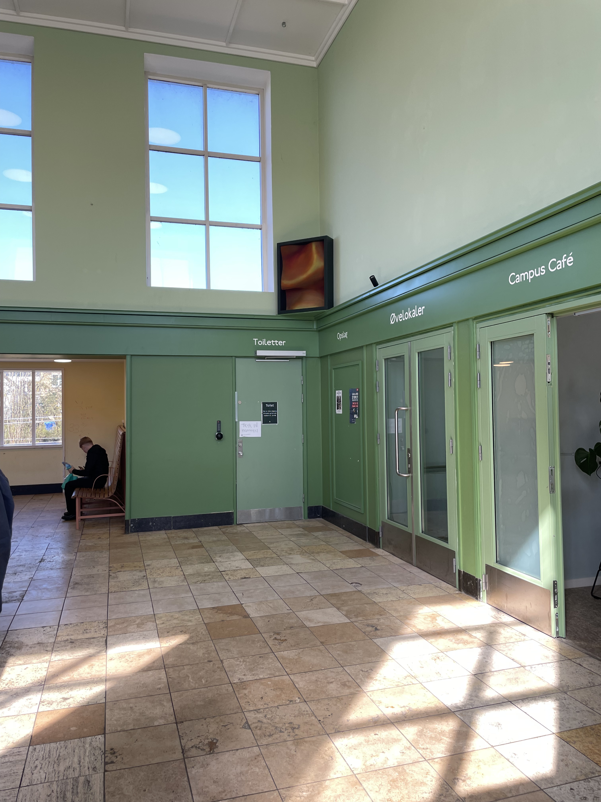
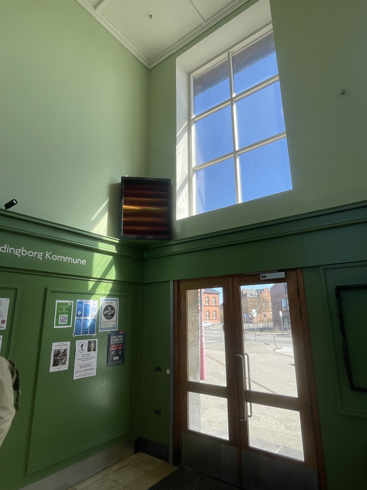

# Genhør Vordingborg Station

An interactive sound installation at Vordingborg train station.

Since 1937, travelers, locals, and employees have moved through this space daily. Over time, the station has evolved — from housing ticket sales, baggage handling, and a restaurant, to now offering room for art, live music, and a youth café.

Genhør Vordingborg Station is a site-specific sound installation that interprets the lives once lived and the sounds once heard in this very space. Historical anecdotes, acoustic instruments, voices from the past, and reimagined sonic scenarios blend with digitally processed train horns, distorted effects, and electric guitars recorded by musicians from the band Flaw, who rehearse in the basement of the station.

The piece interacts with the acoustics of the waiting room, merging with the station’s present-day soundscape to connect past and present life at Vordingborg Station.

The installation is built using a Bela board and programmed in Pure Data, enabling real-time audio processing and responsive interaction in the physical space.

